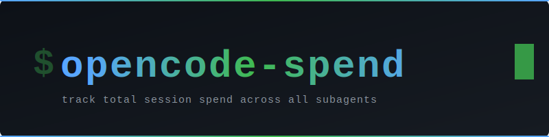
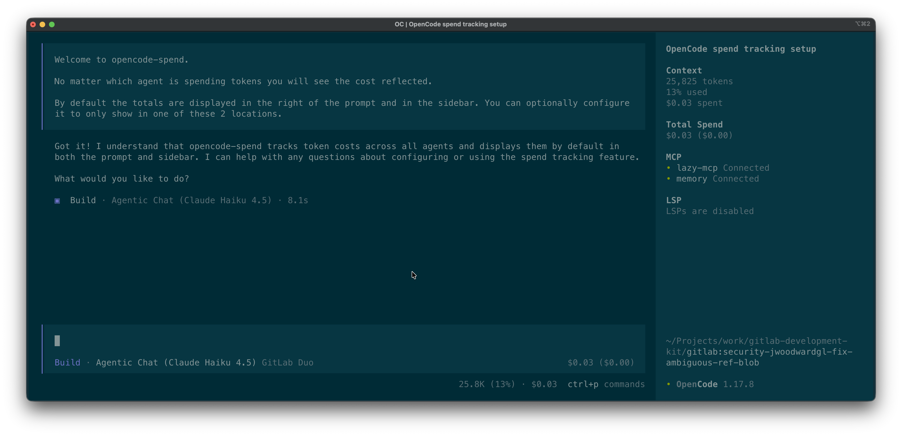

<p align="center">
  
</p>

<p align="center">
  An <a href="https://opencode.ai">opencode</a> TUI plugin that tracks the <strong>true cost</strong> of your session — orchestrator and every nested subagent — live as tokens are consumed.
</p>

<p align="center">
  <a href="https://www.npmjs.com/package/opencode-spend"></a>
  
  
</p>

---

<p align="center">
  
</p>

---

## Installation

Add `opencode-spend` to the `plugin` array in your TUI config:

**`~/.config/opencode/tui.json`** (global) or **`.opencode/tui.json`** (project)

```json
{
  "$schema": "https://opencode.ai/tui.json",
  "plugin": ["opencode-spend"]
}
```

Restart opencode — it installs the plugin automatically via Bun. The **Total Spend** section appears in the sidebar between Context and MCP, and a compact total appears at the right of the prompt footer.

---

## Updating

opencode does not automatically update installed plugins — it caches the installed version, so a new release of `opencode-spend` won't be picked up on its own. To force an update, clear the cached install and start a new session:

```sh
rm -rf ~/.cache/opencode/packages/opencode-spend@latest/
```

Then open a new opencode session. The TUI should briefly show `Loading plugins`, which means opencode is installing the latest version.

---

## Configuration

Create **`~/.config/opencode/spend.json`** to control where the total is displayed:

```json
{
  "location": "both"
}
```

| Value | Display |
|---|---|
| `both` | Sidebar **+** prompt footer *(default)* |
| `sidebar` | Sidebar only |
| `prompt` | Prompt footer only |

---

## Contributing

Issues and PRs welcome at [gitlab.com/jwoodwardgl/opencode-spend](https://gitlab.com/jwoodwardgl/opencode-spend).

### Install locally

```sh
git clone https://gitlab.com/jwoodwardgl/opencode-spend.git
cd opencode-spend
bun install
```

Reference it with a `file://` URL in your `tui.json`:

```json
{
  "$schema": "https://opencode.ai/tui.json",
  "plugin": ["file:///absolute/path/to/opencode-spend"]
}
```

---

<p align="center">MIT License · <a href="https://www.npmjs.com/package/opencode-spend">npmjs.com/package/opencode-spend</a> · <a href="https://gitlab.com/jwoodwardgl/opencode-spend">gitlab.com/jwoodwardgl/opencode-spend</a></p>
